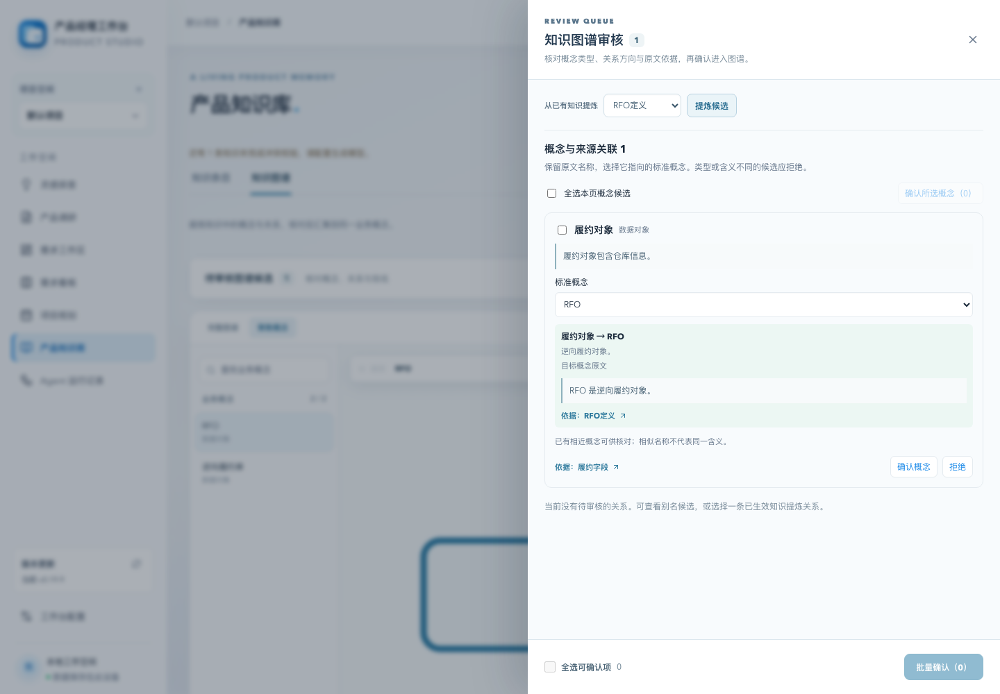
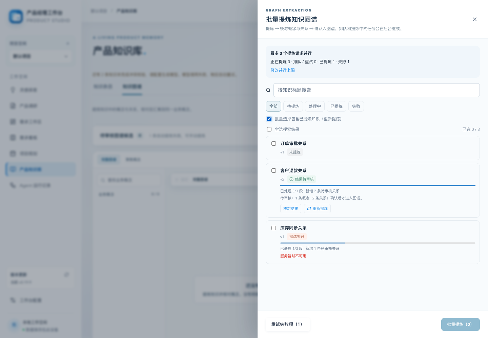
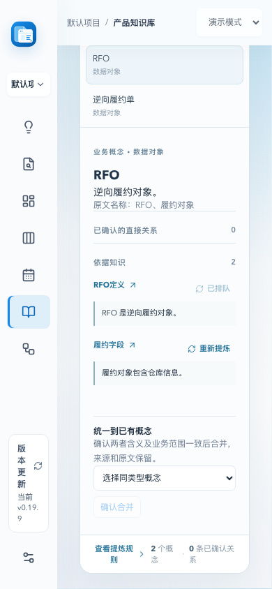
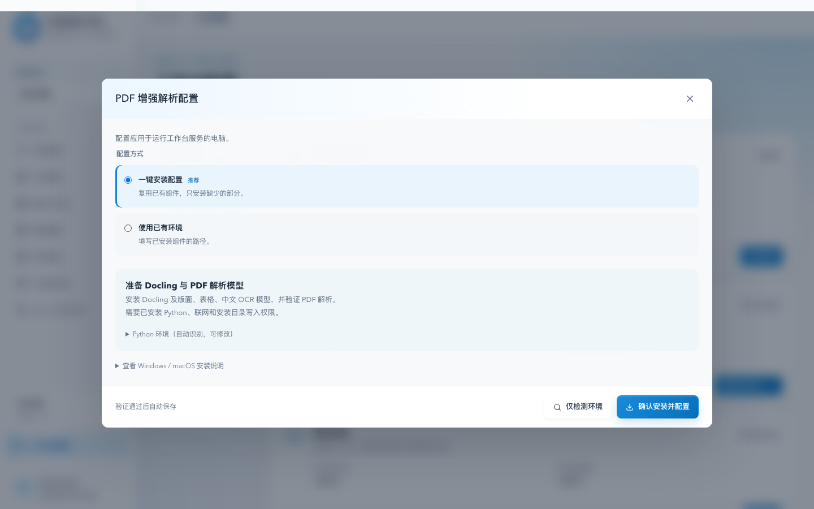
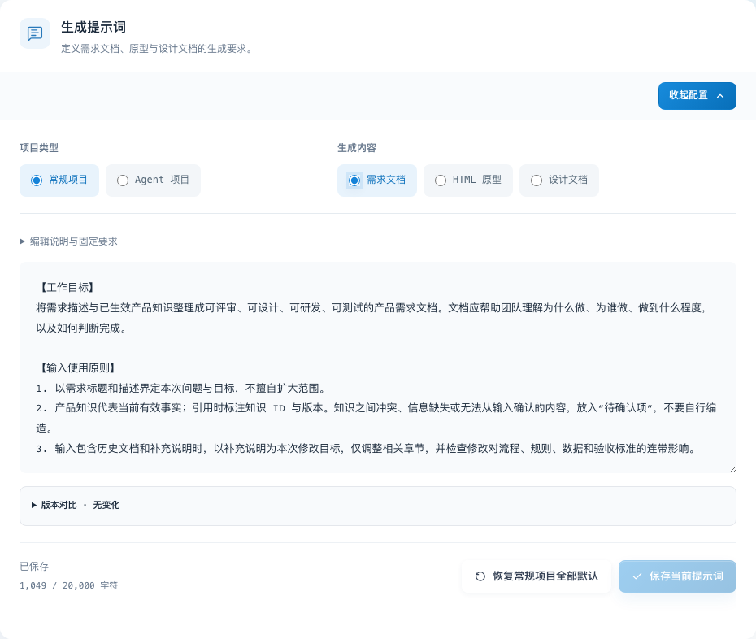
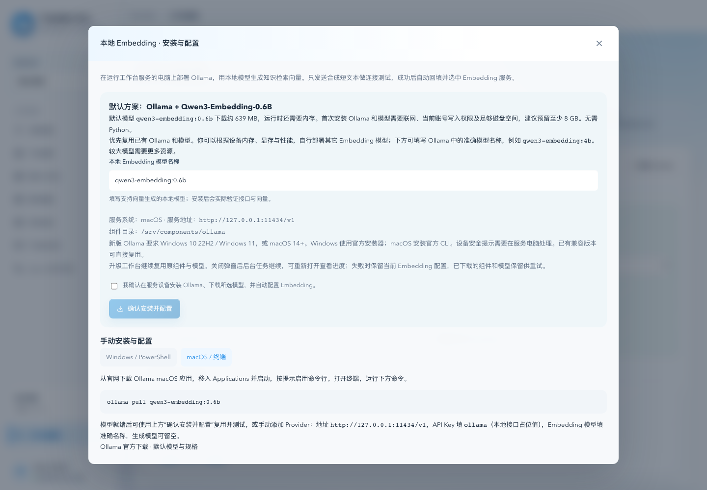

# Product Studio · 产品经理 Agent 工作台

**从灵感到上线，让每一次产品决策成为有版本、有依据、可追溯的资产。**

Product Studio 把灵感探索、产品调研、需求文档、交互原型、设计文档、项目规划与产品知识连接在一条工作流中。Agent 会追问关键问题，帮助把模糊想法整理成需求。记录上线时，Agent 结合已确认的需求文档、原型、设计文档和实际交付内容提炼知识、更新知识库；知识冲突会进入待处理队列，供产品负责人核对。

当前版本：**0.19.9**。

## 0.19.9 知识图谱更新

概念提及与业务关系分别提炼、审核，定义和字段说明也能通过共同概念关联。原文名称保留，审核时可对齐到已有标准概念；同类型概念可人工合并并撤销，状态保留所属单据或状态机范围。

批量面板明确区分排队、提炼中、结果待审核、已入图谱、未发现结果和失败；已在队列的任务不能重复选择，已提炼项可单独或批量重新提炼。图谱概念与关系的来源旁提供“重新提炼”，后台执行并显示进度，已确认结果保留。

升级补齐已有知识对已确认概念和别名的字面提及候选，仍需核对后入图谱，不自动重跑所有旧任务。schema v39，升级前备份完整数据；回退同时恢复旧程序和旧数据。[操作与升级说明](INSTALL.md#0199-知识图谱概念统一与重新提炼)。

## 0.19.8 配置页面更新

工作台配置按“模型与搜索、知识处理、生成与调研、备份与运行”分组，各功能独立显示状态与操作。PDF、浏览器和 Embedding 将一键安装与已有环境合并到同一弹窗，说明按需展开，操作按钮固定在底部。提示词宽屏按项目类型和生成内容并排选择、窄屏使用下拉，切换保留草稿，仅保存当前提示词；保存状态统一放在操作栏。升级继续复用原有配置和组件。

## 核心能力

- **灵感探索与调研：**Agent 主动追问用户、场景、目标和边界，结合产品知识、历史产物与外部调研整理需求；独立搜索和网页读取支持并行处理，并保留已完成请求的断点。
- **需求到设计：**生成并审阅需求文档、可交互 HTML 原型和设计文档，保留版本与上游依据。PRD 验收编号与来源可追踪，引用或版本有问题时提示复核；原型支持逐项流程检查和选中元素局部修改，设计文档提示映射缺项。
- **知识回写：**记录上线时，从当前产物和实际交付中提炼新知识、更新旧口径，并写入知识库。文档分段提炼支持并行与断点恢复，整份完成并通过核对后才写入知识。
- **冲突校验与纠错：**提示相互矛盾的产品知识，支持对比原文、忽略或标记已处理。可在跨源冲突详情中编辑知识的完整标题和正文，保存后重新校验，仍有疑似冲突时自动模型复核；模型不可用时保留已保存内容并允许重试。
- **知识图谱：**从资料引用的 Mermaid 单据关系、状态图和术语表生成待审核的关系与别名；审核后，知识搜索可沿关系扩展最多两跳，并返回原文证据和来源版本。已有知识支持搜索、多选及批量后台提炼，查看分段进度并重试失败项，关闭面板后继续执行。
- **资料导入与 PDF 复核：**支持 Word、HTML、Markdown、TXT 和 PDF。PDF 无可提取文字时可对照原文并尝试本地增强解析，解析正文与表格支持独立滚动查看；导入前仍需逐页核对。
- **规划与任务跟进：**通过需求看板、排期和 Agent 运行记录跟进工作进展。任务保留失败草稿及实际、估算或未知用量，恢复时不会自动重发结果不明的模型请求。
- **模型与运行配置：**接入兼容 OpenAI API 的生成模型、独立 Embedding 与搜索服务；支持一键配置本地 Embedding，以及可视化管理并行上限、浏览器验收、PDF 解析组件和数据备份。

打开「工作台配置 → 知识处理 → 提炼速度」或「生成与调研 → 生成与调研速度」，可调整需求生成任务、知识提炼分段、灵感与调研、知识图谱提炼四类上限，所有项目共用。长知识分段与图谱批量提炼复用有效断点，减少重试时的重复调用；生成结果和图谱关系仍需审核。范围、默认值与保存方式见 [并行设置](INSTALL.md#可视化并行设置)。

冲突校验会结合对象、角色、条件、章节与表格上下文，并识别等价数值单位。规则提示的是疑似冲突，复杂表述仍需模型和产品负责人核对。

## 界面预览

以下截图来自不同版本的演示与验证环境，具体布局以当前版本为准。「客户反馈中心」和冲突规则均为虚构示例，不包含真实项目资料。冲突截图使用测试模型判定；实际使用时需要配置生成模型。

**首页与产品资产流程**

**灵感探索中的 Agent 追问**

**需求文档和交互原型**

**上线时自动提炼并回写产品知识**

**产品知识冲突校验与纠错**

**知识图谱批量提炼**

**PDF 原文对照与增强解析**

**并行执行、运行组件与备份**

**本地 Embedding 配置**

## 安装与启动

1. 安装 Node.js 22.13 或更高版本。在 [最新正式版本](https://github.com/RocLing26/product-studio-releases/releases/latest) 下载 `product-studio-<版本>-intranet.zip` 及同名 `.sha256` 文件，并按 [完整安装说明](INSTALL.md) 校验 SHA-256。
2. 解压 ZIP，进入 `product-studio-<版本>-intranet` 目录，运行 `node server/index.mjs`。包内已包含运行依赖，无需执行 `npm install`。
3. 在本机浏览器打开 `http://127.0.0.1:4310`。默认数据保存在解压目录下的 `.data/`；正式使用建议设置独立的 `PM_DATA_DIR`，备份与迁移步骤见 [安装说明](INSTALL.md#升级)。

这是供浏览器访问的 Node.js 服务包，不是桌面安装程序。多设备内网访问需要配置 HTTPS 地址和访问口令，步骤见 [首次安装](INSTALL.md#首次安装)。

在「知识处理 → PDF 增强解析」或「生成与调研 → 原型浏览器验收」配置组件，在「备份与运行」设置备份目录，路径均指服务所在设备。组件弹窗提供 Windows/PowerShell 与 macOS/终端说明，支持检测、安装和试跑；优先复用已有 Python、组件与模型，后台步骤和日志可随时重新查看，失败时保留原工作台配置。准备方法见 [组件检测与安装](INSTALL.md#组件弹窗一键检测与安装配置0196)。

「立即备份」创建并校验在线数据库快照，同时保存模型、搜索、运行、提示词配置及可用的 `.env`；也可校验最近备份或使用包内独立备份与恢复脚本。外部同步资料目录、组件缓存与 Ollama 模型需另行保留。

工作台可匿名检查正式版本，下载 ZIP 及校验文件并验证完整性，无需 GitHub token。下载后仍需由管理员停服、备份完整数据目录与 `.env`，将新包解压到新的程序目录，使用原配置和数据启动；升级时保留 `operations.json` 及其指向的组件目录，以复用已有环境。详细步骤见 [升级与恢复](INSTALL.md#升级)。

## 模型配置

工作台默认以演示模式运行，不需要模型密钥。要使用真实模型生成、灵感探索和知识冲突判定，打开「工作台配置 → 模型与搜索」：

1. 在「模型服务管理」点击「添加模型服务」，填写服务名称、兼容 OpenAI API 的 `API Base URL` 和 `API Key`。Base URL 通常以 `/v1` 结尾，不要填 `/chat/completions`；远程地址须使用 HTTPS，本机模型可使用 localhost HTTP。
2. 点击「添加模型」，填入服务提供的模型 ID，保存 Provider。
3. 在「生成模型」中选择该模型，再点击「检测」。

Embedding 模型用于知识检索与冲突候选召回，可在 Provider 中填写「Embedding 模型 ID」，再在「Embedding 模型 → 使用已有模型服务」中选择并检测。未配置 Embedding 时使用本地向量召回；**冲突结论仍需已配置的生成模型**。外部调研需另行配置搜索服务。详细步骤和环境变量配置见 [完整安装说明](INSTALL.md#模型配置)。

希望在本机运行 Embedding 时，可在「Embedding 模型」中点击「开始配置」（已配置时为「管理配置」），选择「一键配置本地模型」，默认使用 Ollama + `qwen3-embedding:0.6b`，也可按设备能力修改模型名称。阅读说明并确认后才安装组件和下载模型；优先复用已有环境，通过向量试跑后自动回填并选中 Embedding 服务，生成模型配置保持。关闭弹窗后后台继续，重新打开可查看步骤与日志，失败时可重试。

本地 Embedding 的安装与下载在工作台服务所在设备执行，支持 Windows/macOS；首次准备需要联网、写入权限和足够的磁盘与内存。系统要求、手动部署与模型迁移见 [本地 Embedding 配置说明](INSTALL.md#本地-embedding-一键配置0197)。
