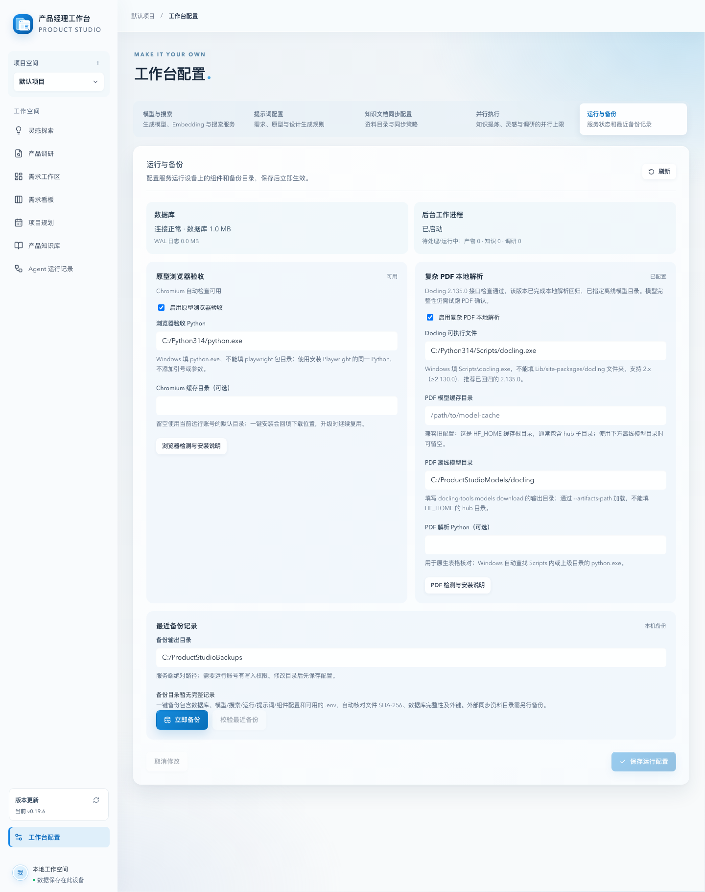
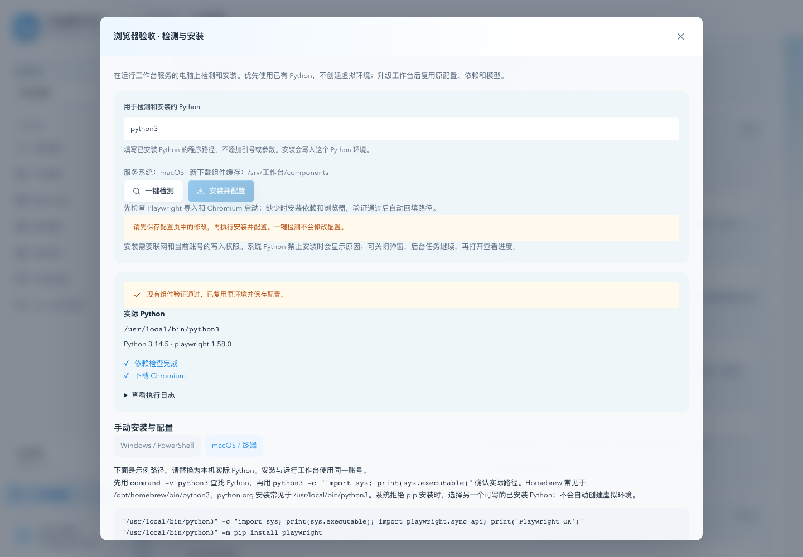
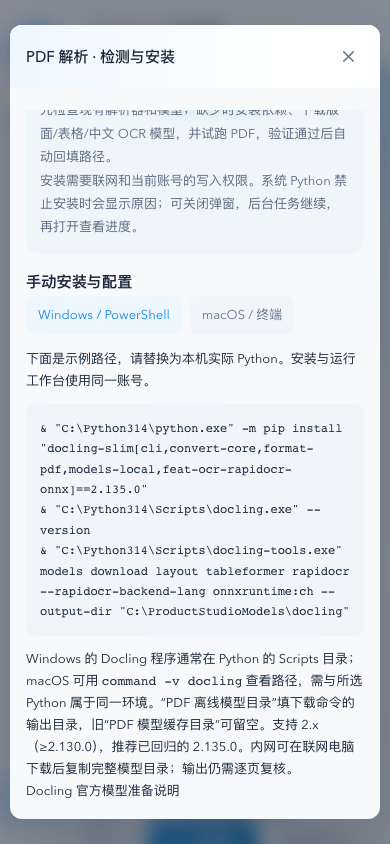
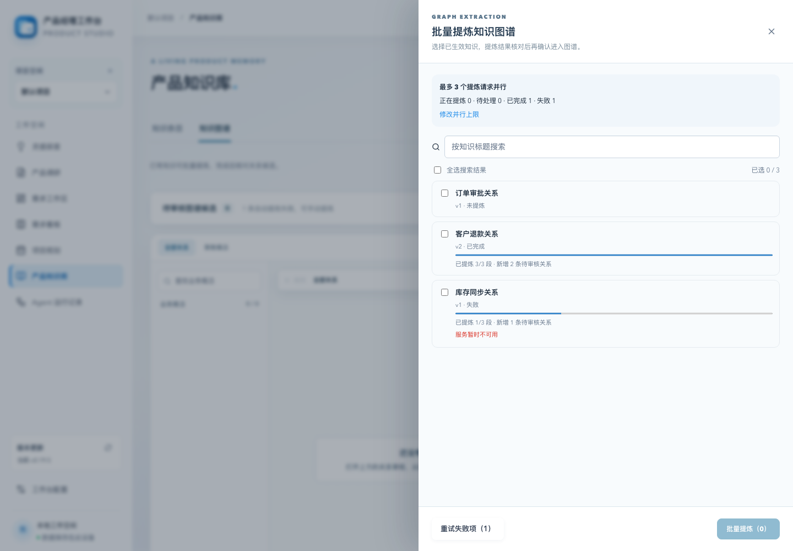
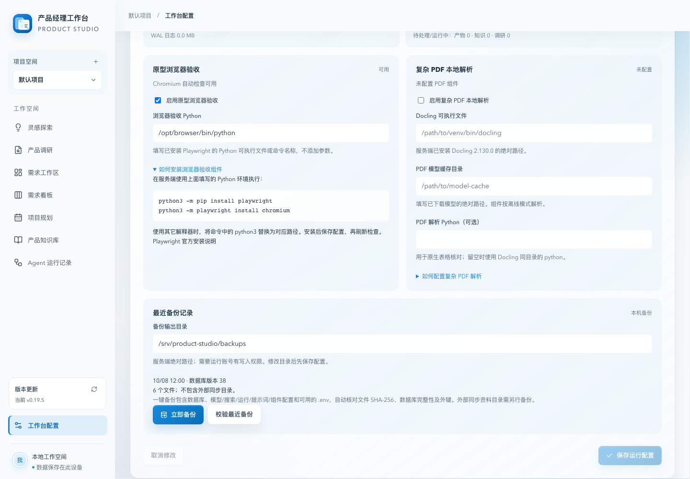
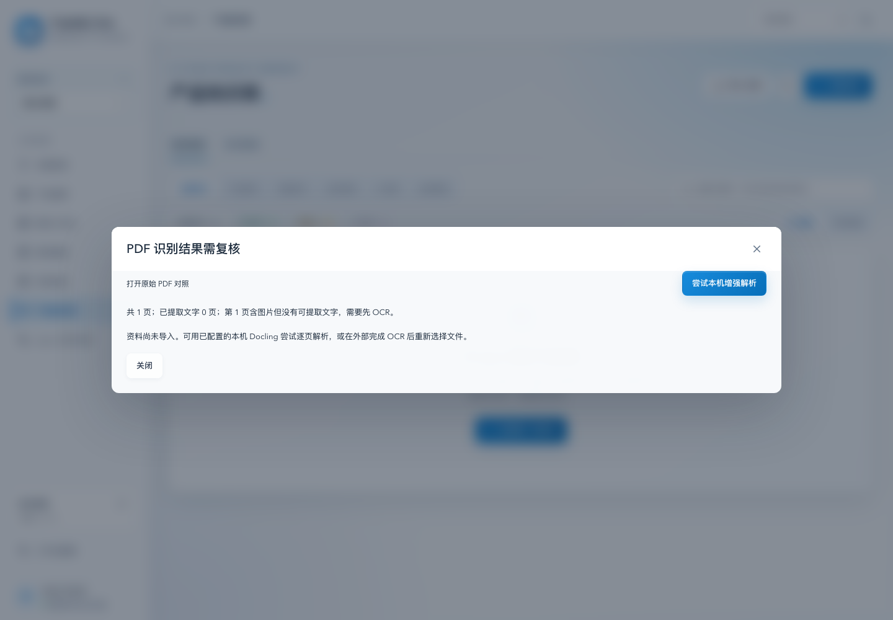
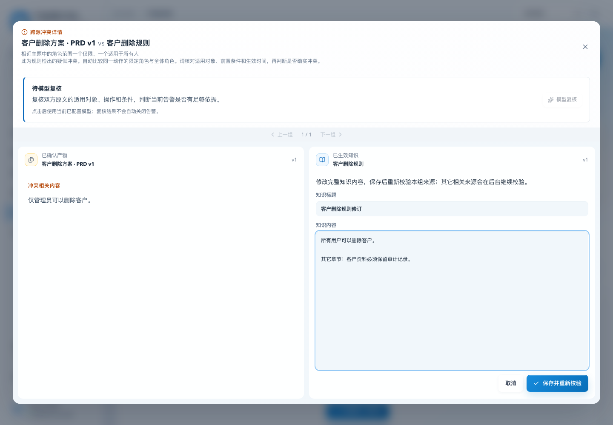
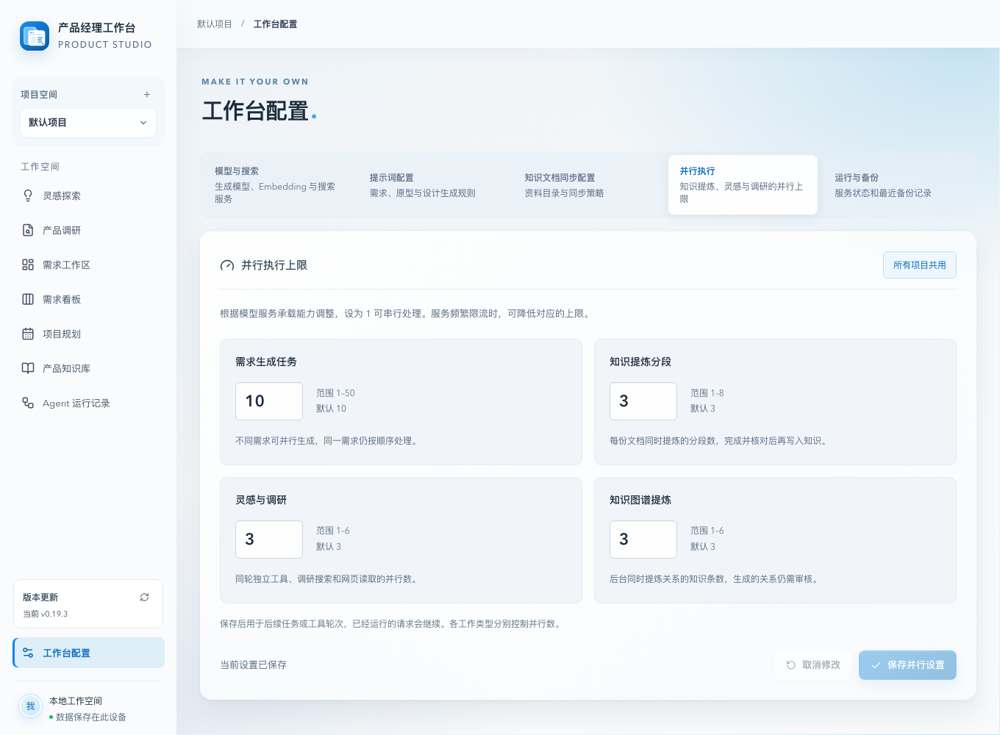

# Product Studio · 产品经理 Agent 工作台

**从灵感到上线，让每一次产品决策成为有版本、有依据、可追溯的资产。**

Product Studio 把灵感探索、产品调研、需求文档、交互原型、设计文档、项目规划与产品知识连接在一条工作流中。Agent 会追问关键问题，帮助把模糊想法整理成需求。记录上线时，Agent 结合已确认的需求文档、原型、设计文档和实际交付内容提炼知识、更新知识库；知识冲突会进入待处理队列，供产品负责人核对。

当前版本：**0.19.6**。

## 0.19.6 组件检测、安装弹窗与Windows兼容

“运行与备份”的安装说明改为弹窗，提供Windows/PowerShell和macOS/终端步骤。一键检测显示实际Python和组件版本，分别检查Playwright导入与Chromium启动；PDF检测检查Docling解析接口并试跑合成PDF。安装缺失依赖/浏览器/模型后自动回填配置，后台显示步骤和日志，关闭弹窗后可重新查看。

优先使用已有Python，不自动创建虚拟环境。已可用的组件和模型跳过安装下载；升级工作台继续复用原配置、Python、模型和浏览器缓存。系统Python禁止pip安装时显示原因，安装失败不会更新工作台指向。

修复Windows组件环境变量、程序路径提示和中文编码，区分“未安装”与内部依赖导入失败。Docling接受兼容的2.x（≥2.130.0），检查必需参数与输出结构，记录实际版本；2.130.0/2.135.0已有本地合成中文正文、表格和扫描页回归。新增PDF离线模型目录，与原HF_HOME缓存目录分别配置。

本轮包含本机真实检测、模型离线调用及复用验证；Windows路径和安装分支为模拟回归，完整Windows原机安装仍需验证。步骤见[安装说明](INSTALL.md#组件弹窗一键检测与安装配置0196)。

## 0.19.5 图谱批量提炼、运行配置与PDF复核

“知识图谱 → 批量提炼已有知识”支持搜索、多选/全选、后台提交、分段进度及失败项重试，关闭面板后继续。长知识分段并行，自动/手动/批量共用图谱请求上限，成功分段断点支持重试及重启复用，结果仍需审核。固定60ms本地对照，6段长知识371.62ms→125.70ms，调用均6；混合9条任务182.92ms→145.08ms，调用均9。受控收益不代表真实模型延迟或准确率。

“工作台配置 → 运行与备份”可视化修改组件启停、Python/Docling/模型路径与备份目录，保存后生效并重新检查组件。提供安装说明、立即备份和最近备份校验，数据库与各类配置（含operations.json）一并保存。页面采用无边框浅色卡片，外部同步资料目录仍需单独备份。

PDF 默认提取文字0页时，原文对照与增强解析按钮固定在标题下，不显示空正文框或导入按钮；增强结果的正文/表单单独滚动。知识库、计划和附件入口共享桌面/手机布局；Word/HTML/Markdown/TXT导入也已回归。schema v38 增加图谱分段断点，少字页和人工复核要求保持。

## 0.19.4 跨源冲突知识纠错与误判修正

跨源冲突详情的知识侧支持编辑完整标题和正文，点击“保存并重新校验”后立即检查本组来源；仍有疑似冲突时自动模型复核。保存检查知识与来源版本，错误时保留输入；模型不可用会明确提示知识已保存，可再次复核。

本轮修正单位等价、不同对象/地区/套餐/生效范围混比、逗号前条件丢失、相同角色的“仅/所有”误判，保留章节和表格上下文。规则只提示疑似冲突，复杂改写仍需模型与人工核对。升级后旧扫描按新规则逐步重做，保留人工处理决定和已有复核记录；受控回归不代表真实业务准确率。

## 0.19.3 统一配置与速度优化

打开 **工作台配置 → 并行执行**，可视化调整需求生成任务、知识提炼分段、灵感与调研、知识图谱提炼四类上限。Agent 运行记录页只显示当前上限并提供跳转；原编辑表单已合并。界面提示范围/默认值、拦截越界和非整数，只保存修改项，保存失败保留输入。

本轮改善长文接续边界去重和流式正文/思考回调处理；图谱后台默认三路提炼并连续处理，冲突扫描复用未变正文的本地向量并逐条连续处理，Docling 并发状态探测共用一次进程。正文、证据、用量、失败退避和人工审核保留。

固定每次 60ms 的本地对照，6 条关系提炼 369.92ms → 123.98ms（约减少 66.5%）；100 条知识的 20 次本地候选检索 128.99ms → 17.05ms，候选和分数一致。真实模型与完整业务链收益仍需实测，PDF/OCR 识别规则未改。

## 核心能力

- **灵感探索：**Agent 主动追问用户、场景、目标和边界，结合产品知识与历史产物整理需求。
- **需求到设计：**生成并审阅需求文档、可交互 HTML 原型和设计文档，保留版本与上游依据。
- **知识回写：**记录上线时，从当前产物和实际交付中提炼新知识、更新旧口径，并写入知识库。
- **冲突校验：**提示相互矛盾的产品知识，支持对比原文、忽略或标记已处理。
- **知识图谱：**从资料引用的 Mermaid 单据关系、状态图和术语表生成待审核的关系与别名；审核后，知识搜索可沿关系扩展最多两跳，并返回原文证据和来源版本。
- **规划跟进：**通过需求看板、排期和 Agent 运行记录跟进工作进展。

## 0.19.3 更新

- PRD验收编号与来源追踪更完整，引用或版本有问题时先提示复核，再进入下游流程。
- 原型支持逐项流程检查与选中元素局部修改，设计文档显示具体映射缺项。
- 任务保留失败草稿与实际、估算或未知用量；恢复不会自动重发结果不明的模型请求。
- 交付包新增独立备份与恢复入口，可校验数据库、模型配置和访问口令。操作步骤见[数据保存与升级](INSTALL.md#数据保存与升级)。

## 界面预览

以下截图由 v0.14.12 在全新临时数据目录生成。「客户反馈中心」和冲突规则均为虚构示例，不包含真实项目资料。冲突截图使用测试模型判定；实际使用时需要配置生成模型。

**首页与产品资产流程**

**灵感探索中的 Agent 追问**

**需求文档和交互原型**

**上线时自动提炼并回写产品知识**

**产品知识冲突校验**

## 安装与启动

1. 安装 Node.js 22.13 或更高版本。在 [Releases](https://github.com/RocLing26/product-studio-releases/releases/latest) 下载 `product-studio-0.19.5-intranet.zip` 及同名 `.sha256` 文件，并按 [完整安装说明](INSTALL.md) 校验 SHA-256。
2. 解压 ZIP，进入 `product-studio-0.19.5-intranet` 目录，运行 `node server/index.mjs`。包内已包含运行依赖，无需执行 `npm install`。
3. 在本机浏览器打开 `http://127.0.0.1:4310`。默认数据保存在解压目录下的 `.data/`；正式使用建议按 [完整安装说明](INSTALL.md#数据保存与升级)设置独立的 `PM_DATA_DIR`。

这是供浏览器访问的 Node.js 服务包，不是桌面安装程序。多设备内网访问需要配置 HTTPS 地址和访问口令，步骤见 [内网部署](INSTALL.md#内网-https-部署)。

## 模型配置

工作台默认以演示模式运行，不需要模型密钥。要使用真实模型生成、灵感探索和知识冲突判定，打开「工作台配置 → 模型与搜索」：

1. 点击「添加 Provider」，填写服务名称、兼容 OpenAI API 的 `API Base URL` 和 `API Key`。Base URL 通常以 `/v1` 结尾，不要填 `/chat/completions`；远程地址须使用 HTTPS，本机模型可使用 localhost HTTP。
2. 点击「添加模型」，填入服务提供的模型 ID，保存 Provider。
3. 在「当前生成配置」选择该模型，点击「测试生成模型连接」。

Embedding 模型用于知识冲突候选召回，可在 Provider 中填写「Embedding 模型 ID」，再选择「知识冲突检索服务」并测试连接。未配置 Embedding 时使用本地向量召回；**冲突结论仍需已配置的生成模型**。详细步骤和环境变量配置见 [完整安装说明](INSTALL.md#模型配置)。

工作台可检查正式版本并校验下载完整性；下载后仍需由管理员按说明升级。
